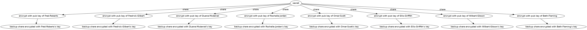

# OESR: Offline Emergency Secret Recovery 

A methodology or system for a long term backups of critical and sensitive data with a focus on maintainability to make it simple, quick and pain free to create new secure offline backups. 


## Description

Keeping long term offline only backups is hard and there is many pitfalls. Hardware can fail or get destroyed so you need multiple copies and in multiple locations, but travel time quickly adds up especially if your copies are not local or you have a ton of them. So it's easy to miss traveling to each copy for new things you want to add or get sloppy because of the hassle and not take backups at all. This also has security pitfalls, as you have more copies in multiple locations it gets harder to ensure the physical security of the copies, one might get stolen or lost. 

The idea behind OESR is to have a cost effective offline backup system that is both cost effective, secure and has a low upfront cost of creating a new backup of sensitive data limiting the travel needed to first time setup and when you actually need to restore a secret. This is made possible through [Shamir's Secret Sharing](https://en.wikipedia.org/wiki/Shamir%27s_Secret_Sharing)(SSS) and [PKI](https://en.wikipedia.org/wiki/Public_key_infrastructure).

## Origin / Background 

Before this I had a similar system for backing up my gpg keys, that setup consisted of symmetrically encrypting my gpg key with a 64 character key and then splitting this into 7 parts which was placed on each usb. The symetrical key I also split into a few pieces and created qr codes for these shares and hid them in various places.

This worked fine and I was very happy with the security, however this was completely un-maintainable over time as I wanted to add more things. The logistics of gathering all my usbs into one place was such a pain, as well as this was a potential security flaw as this introduced a time of vulnerability.

So I wanted to solve how I keep the aspects I like but make this actually maintainable for me, through a ton of thinking and discussions about this problem space the solution that emerged is that you need to split the data and the encryption. 

The encryption keys rarely need to be changed or accessed unless all hell breaks loose and I need to actually recover something, so instead this method is designed in such a way that on the usb's you store the way to recover the secrets and so you can encrypt new secret without access to the encryption keys, then you can store the data in the cloud, on usbs, paper or whatever medium you wish.

## Description

*Note I'm using dsprenkels implementation of ssss which already generates a random key and encrypts the data with the key. Normally it is not safe to split anything other than completely random data with SSS*

The core principle of this methodology is having a number of what I will call _peers_, this is essentially just a usb that you could give to someone, or hide somewhere. These usbs all have their own pgp key, however they also contain a SSS share of each others keys. So that as a group you can always "restore" another peer, this is for the sake of redundancy. 

Example: person 1 splits their key into N shares which is the number of people - 1 since you own your own complete key, and setting the threshold to 3. This means that we have a redundancy of 1, we can lose one usb before it is no longer possible to recover a peer.


Another example to illustrate the key sharing between the peers:


These peers will then stay offline at all times to ensure they can't be accessed or tampered with, you won't need them again until you actually want to do an emergency restore on a secret. 
To create a new secret you would take some data SSS split it into as many shares as you have peers and then you would take each share and encrypt it with the public key of  each peer. This way you have created redundancy in that you can loose either a share or a usb and as long as you have enough to meet the threshold you can decrypt the backup again by traveling to each peer and unlocking that specific share.

Example: You can see a smaller version of the same setup in action here, a secret is split into one share per key holder and each share is encrypted with their public key.


To actually restore this secret if the SSS threshold was set to 3 then we would need to get physical access to 3 keyholders.


The result of splitting the encryption and the data like this means that it is super easy to create another secret and it lowers the barrier at how paranoid you have to be about how you store the actual data, you can create many copies of it however you will not be able to access it other than in person

# Using OESR

This requires the nix package manager with nix flakes enabled to run. And that is simply because I love nix and I exclusively run nixOS so I built this whole setup around it, I'm sure you can do this via another distributions live-cd however you'll need to figure that out on your own.

If you want to try your hand at this then this is what you'll need:
- python37 and dependencies (can be found in pyproject.lock)
- [sss-cli](https://github.com/dsprenkels/sss-cli)
-  gnupg
-  hopenpgp-tools

## OESR Encryption keys setup
### Live CD Setup

```sh
nix build './live-cd#nixosConfigurations.liveCD.config.system.build.isoImage' 
```
_iso can be found in `./result/iso/`_ 

*Then use this to make a bootable usb*
```sh
cp -vi result/iso/*.iso /dev/sdX
```

### Generate keys

**IMPORTANT!** *Boot from the live usb and unplug ethernet/hardware disable the wifi*

Example generate oesr keys for 6 people with the threshold 4 and output it to `/tmp/out`
```sh
oesr-cli generate "firstname-lastname-1" "firstname-lastname-2" "firstname-lastname-3" "firstname-lastname-4" "firstname-lastname-5" "firstname-lastname-6" -t 3 -o /tmp/out
```

## Setup usbs with OESR encryption setup

This step needs to be done for each person in the oesr circle and requires a separate usb for each person.

### Scripted usb setup
Since I'm lazy and don't like doing this so many times, so I wrote a small and somewhat naive [script](./oesr_usb_setup.py) to setup the usb for me. **!USE AT YOUR OWN RISK!**
```
# This wipes the device, creates an encrypted luks volume and copies over the person's exported output. It will ask you to confirm before starting.
> sudo oesr-usb-setup -d /dev/sdX -p "<my-password>" -i /tmp/out/<person>
```

### Verification
_it's important to verify the password works after the usb is generated, do this manually._

```sh
# Test open with manual password entry
> sudo cryptsetup luksOpen $USB_DEVICE

# Close the encrypted partition again
> sudo cryptsetup luksClose $USB_DEVICE
```

### Manual usb setup

```sh
# Select the usb block device
> USB_DEVICE=/dev/sdX
# Select the person to export to usb
> OESR_IDENTITIY=/tmp/out/<person>

# Wipe the block_device
> sudo wipefs -a $USB_DEVICE

# Set the luks passphrase
> LUKS_PW="this is my passphrase"

# Luks format the device
> echo -n $LUKS_PW | sudo cryptsetup luksFormat $USB_DEVICE -
# Open luks device
> echo -n $LUKS_PW | sudo cryptsetup luksOpen $USB_DEVICE oesr-enc-usb -

# Format encrypted partition and set label to be the persons name
> sudo mkfs.ext2 /dev/mapper/oesr-enc-usb -L <person>

# mount encrypted partition
> sudo mount /dev/mapper/oesr-enc-usb /mnt

# Copy over the relevant files
> cp -r $OESR_IDENTITY /mnt

# Unmount encrypted partition
> umount /mnt

# Close oesr-enc-usb
> sudo cryptsetup luksClose /dev/mapper/oesr-enc-usb

```


### Keep a copy of the public directory

Make sure you also grab a copy of the public directory `/tmp/out/public` which contains all the public keys, make sure you don't loose this. You could upload the keys to keyservers and just keep a physical paper containing all the fingerprints.

### Distribute the keys

Distribute the keys to your peers or hide them in places you'll remember.

## Backup secret

To create a new secret use the sss-cli to split a secret, you can use this line to create a separate file for each share.

```sh
secret-share-split -n 6 -t 4 secret.txt | awk '{ printf "%s,%s\n", NR, 1}'| while IFS=',' read -r index share; do echo "${share}" > secret_share_${index}.txt; done
```

Then gpg encrypt each share with the corresponding peer's gpg key.

```sh
gpg -e -r firstname-lastname-1  -o secret_share_1.txt.enc secret_share_1.txt
```

# Hacking

You can see more about the nix development setup [here](./docs/HACKING.md).
