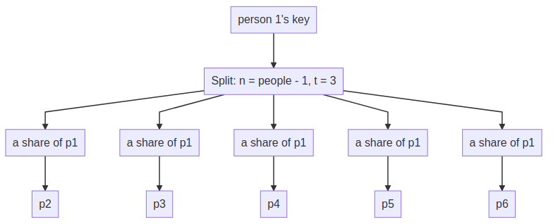
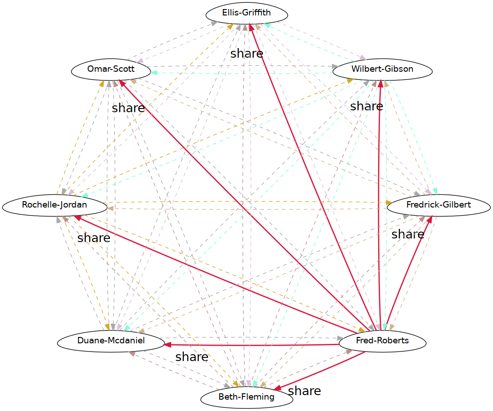

# OESR: Offline Emergency Secret Recovery 

A methodology for long term backup of critical and sensitive data leveraging secret sharing and pki.

## Background


## Explanation







# OESR Setup

## Live CD setup

### Generate a NixOS live cd with the required packages
```sh
nix build './nix-live-cd#nixosConfigurations.liveCD.config.system.build.isoImage' 
```
_iso can be found in `./result/iso/`_ 

### Copy the live cd to a usb
```sh
cp -vi result/iso/*.iso /dev/sdX
```

## Generate keys

**IMPORTANT!** *Boot from the live usb and unplug ethernet/hardware disable the wifi*

### Example generate oesr keys for 6 people with the threshold 4 and output it to `/tmp/out`
```sh
oesr-cli generate "firstname-lastname-1" "firstname-lastname-2" "firstname-lastname-3" "firstname-lastname-4" "firstname-lastname-5" "firstname-lastname-6" -t 3 -o /tmp/out
```

## Setup usb

This step needs to be done for each person in the oesr circle and requires a separate usb for each person.

### Manual usb setup

```sh
# Select the usb block device
> USB_DEVICE=/dev/sdX
# Select the person to export to usb
> OESR_IDENTITIY=/tmp/out/<person>

# Wipe the block_device
> sudo wipefs -a $USB_DEVICE

# Set the luks passphrase
> LUKS_PW="this is my passphrase"

# Luks format the device
> echo -n $LUKS_PW | sudo cryptsetup luksFormat $USB_DEVICE -
# Open luks device
> echo -n $LUKS_PW | sudo cryptsetup luksOpen $USB_DEVICE oesr-enc-usb -

# Format encrypted partition and set label to be the persons name
> sudo mkfs.ext2 /dev/mapper/oesr-enc-usb -L <person>

# mount encrypted partition
> sudo mount /dev/mapper/oesr-enc-usb /mnt

# Copy over the relevant files
> cp -r $OESR_IDENTITY /mnt

# Unmount encrypted partition
> umount /mnt

# Close oesr-enc-usb
> sudo cryptsetup luksClose /dev/mapper/oesr-enc-usb

```

### Scripted usb setup
Since I'm lazy and don't like doing this so many times I wrote a small and somewhat naive [script](./oesr_usb_setup.py) to setup the usb for me. **!USE AT YOUR OWN RISK!**
```
# This wipes the device, creates an encrypted luks volume and copies over the person's exported output. It will ask you to confirm before starting.
> sudo oesr-usb-setup -d /dev/sdX -p "<my-password>" -i /tmp/out/<person>
```

### Verification
_it's important to verify the password works after the usb is generated, do this manually._

```sh
# Test open with manual password entry
> sudo cryptsetup luksOpen $USB_DEVICE

# Close the encrypted partition again
> sudo cryptsetup luksClose $USB_DEVICE
```

# Development

nix-build:
```sh
# Build package
> nix build

# Create key structure
> rm -r /tmp/out; ./result/bin/oesr-cli generate Rhea-Thisbe Nessa-Amor Kleio-Ing Hormazd-Philandros Hel-Phineus -t 4 -o /tmp/out;

# Verify created keys
> ./result/bin/oesr-cli verify -o /tmp/out;

# Lint created keys
> ./result/bin/oesr-cli lint -o /tmp/out;
```

nix-shell
```sh
# Build package
> nix develop

# Create key structure
> rm -r /tmp/out; oesr-cli generate Rhea-Thisbe Nessa-Amor Kleio-Ing Hormazd-Philandros Hel-Phineus -t 4 -o /tmp/out;

# Verify created keys
> oesr-cli verify -o /tmp/out;

# Lint created keys
> oesr-cli lint -o /tmp/out;
```

_oesr.json example_
```json
{
  "people": {
    "Rhea-Thisbe": {
      "identity": "strudel-approach", # this is the pseudonym used my gpg
      "fpr": "3BCB608512775880626FBF95013598E3DFE11B63"
    },
    "Nessa-Amor": {
      "identity": "finalize-bonehead", # this is the pseudonym used my gpg
      "fpr": "E3D40CDE6EAD90CB3A56BAA8109355E43FC43A91"
    },
    "Kleio-Ing": {
      "identity": "morally-clammy", # this is the pseudonym used my gpg
      "fpr": "5B538056832EED1F12F4CA28844F6AF0DAE37D02"
    },
    "Hormazd-Philandros": {
      "identity": "excuse-swizzle", # this is the pseudonym used my gpg
      "fpr": "230C950B5B1431F629868AF546249560B4712A40"
    },
    "Hel-Phineus": {
      "identity": "finlike-resource", # this is the pseudonym used my gpg
      "fpr": "6DF84228287C9439A16837B9E617E8F1CEF3E60F"
    }
  },
  "threshold": 4, # The threshold value set when generating the code for the first time.
  "num": 5 # TODO remove this, double check the code that this isn't created anymore
}
```

